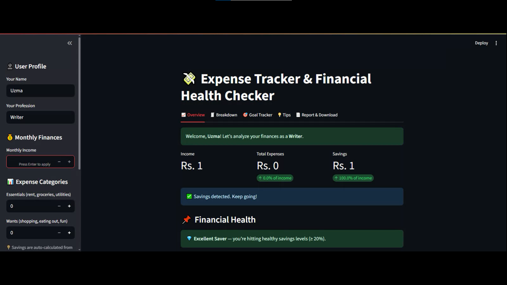

### 💰 Expense Tracker & Financial Health Checker  

[](https://www.python.org/)  
[](https://streamlit.io/)  
[](https://plotly.com/python/plotly-express/)  
[](https://github.com/uzmajawed/expense-tracker/pulls)  
[](https://github.com/uzmajawed/expense-tracker/stargazers)  

---

### 📌 About the Project  
This **Expense Tracker & Financial Health Checker** started as a **Command-Line Interface (CLI)** Python project 🎯 and has now evolved into a **Streamlit Web App** with an intuitive UI, colorful charts, and enhanced expense management features.  

Track your **essentials**, **wants**, and automatically calculate **savings**. Visualize your spending with an interactive **pie chart** and enjoy a polished interface with emoji-friendly navigation.  

---

### 📽 Demo  

🎥 **YouTube Walkthrough**: [Watch Here](https://youtu.be/4sd73lPJ7jU?si=oPG38HgZazGQK2iT)  

📸 **App Preview**:  


---

### ✨ Features  

✅ **Essentials & Wants Input** → Auto Savings Calculation 💰  
✅ **Pie Chart Visualization** using Plotly 📊  
✅ **Sidebar Navigation** for clean workflow 🗂  
✅ **Emoji-enhanced UI** 🌸  
✅ **Instant Financial Health Check** 🧠  
✅ **Lightweight & Fast** ⚡  

---

## 🛠 Tech Stack  

| Tool / Library        | Purpose            |
|-----------------------|--------------------|
| **Python** 🐍         | Core logic         |
| **Streamlit** 🌐      | Web app framework  |
| **Plotly Express** 📊 | Interactive charts |
| **Pandas** 📑         | Data handling      |

---

## 🔮 Future Improvements 🚀

* 📅 **Monthly Budget Planner**
* 📊 **Trend Line Graph** for spending patterns over time
* 💾 **Save & Load Past Records** in a database (SQLite)
* 📱 **Responsive Mobile Version** of the app
* 🌐 **Deploy on Streamlit Cloud** for public access

---

## 🤝 Connect with Me

🔗 **LinkedIn**: [Uzma Jawed](https://www.linkedin.com/in/uzma-jawed-21684728b/)
💻 **GitHub**: [uzmajawed](https://github.com/Uzma-Jawed)

---

### 📥 Installation  

### 1️⃣ Clone the Repository  
```bash
git clone https://github.com/Uzma-Jawed/expense_tracker_assignment.git
cd expense_tracker_project
````

### 2️⃣ Install Dependencies

```bash
pip install -r requirements.txt
```
### 🚀 Usage

### **Run Streamlit App**

```bash
streamlit run app.py
```

### **Run CLI Version**

```bash
python expense_tracker_project.ipynb
```

---